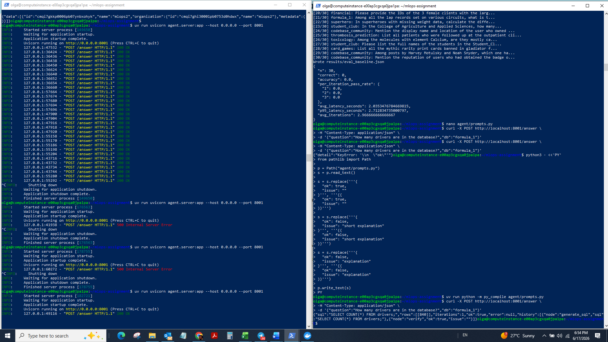
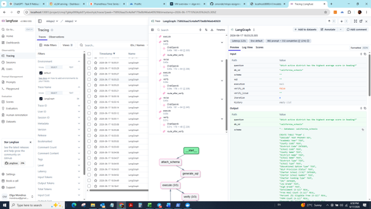
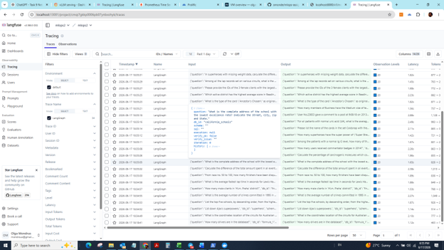
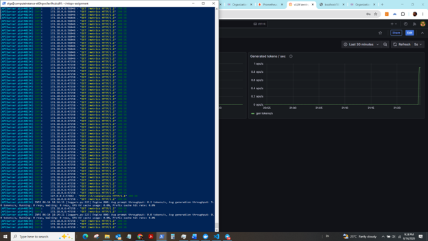
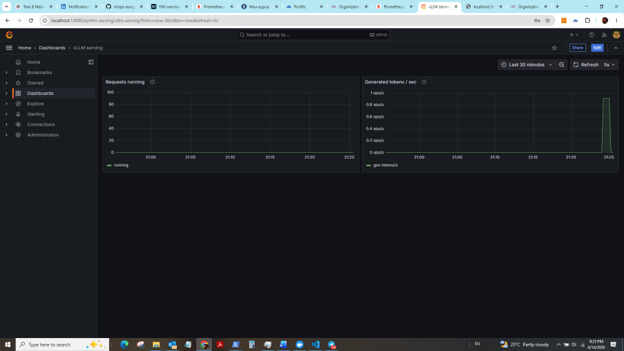
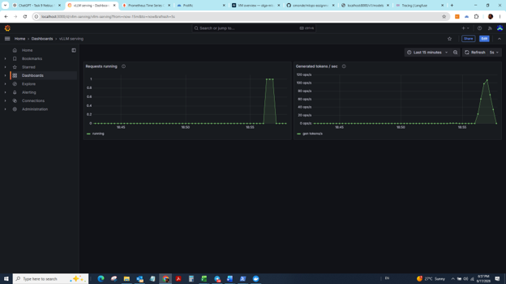

# HW2: LLM Inference + Observability

## Overview

The goal of this assignment was to build a complete text-to-SQL proof of concept consisting of:

1. An LLM inference layer using vLLM serving Qwen3-30B-A3B-Instruct-2507.
2. An observability stack using Prometheus and Grafana.
3. A LangGraph-based agent capable of generating, executing, verifying, and revising SQL queries.
4. Tracing and debugging with Langfuse.
5. An evaluation framework based on execution accuracy using the BIRD benchmark subset.
6. Performance analysis and optimization.

The assignment involved significantly more debugging and infrastructure work than model development. The most challenging parts were environment configuration, Langfuse authentication, SSH port forwarding, prompt engineering, and debugging agent behavior.

---

# Phase 0: Setup

## Environment

The assignment was completed on a Nebius H100 VM.

Main tools used:

* Python 3.12
* uv package manager
* Docker and Docker Compose
* vLLM 0.10.2
* LangGraph
* Langfuse
* Prometheus
* Grafana

## Setup Steps

```bash
uv sync
uv run python scripts/load_data.py
docker compose up -d
```

Verified availability of:

* Grafana: localhost:3000
* Prometheus: localhost:9090
* Langfuse: localhost:3001

## Challenges

The setup stage required troubleshooting Docker, WSL, SSH port forwarding, and environment configuration. Considerable time was spent verifying that requests reached the correct services running on the VM.

---

# Phase 1: vLLM Deployment

## Objective

Serve Qwen3-30B-A3B-Instruct-2507 using vLLM on a single H100 GPU.

## Configuration

Model:

```text
Qwen/Qwen3-30B-A3B-Instruct-2507
```

Endpoint:

```text
http://localhost:8000/v1
```

The server was started using the provided scripts and validated through the OpenAI-compatible API.

## Validation

The following checks were performed:

1. Model loading completed successfully.
2. `/v1/models` returned available models.
3. Manual text-to-SQL prompts generated valid SQL.
4. The LangGraph agent successfully connected to the endpoint.

### Screenshot



## Challenges

The local laptop was insufficient for running the full model, therefore final testing was performed on the H100 VM. Several iterations were required before obtaining stable serving and correct endpoint configuration.

## Outcome

vLLM successfully served the model and supported both manual testing and agent execution.

---

# Phase 2: Observability with Prometheus and Grafana

## Objective

Monitor model serving performance.

## Dashboard Categories

### Latency

Metrics used to understand request processing delays:

* Request latency
* Generation latency
* Percentile latency

### Throughput

Metrics used to understand serving capacity:

* Requests per second
* Tokens generated per second
* Throughput during evaluation runs

### KV Cache

Metrics used to evaluate serving headroom:

* Cache utilization
* Memory headroom
* Potential cache bottlenecks

## Dashboard Design

The starter Grafana dashboard was extended to provide visibility into:

* Request bursts
* Token generation rates
* Latency changes during evaluation runs

## Challenges

Initially dashboards appeared empty because no traffic was reaching the model. After generating traffic through manual testing and evaluation runs, metrics populated correctly.

## Outcome

Grafana successfully visualized serving behavior and provided visibility into latency, throughput, and cache utilization.

### Dashboard


---

# Phase 3: LangGraph Agent

## Objective

Build a self-correcting text-to-SQL agent.

## Architecture

Question
→ Attach Schema
→ Generate SQL
→ Execute SQL
→ Verify Result
→ Revise SQL (if needed)
→ Execute Again

Maximum iterations were capped to prevent infinite loops.

## Components

### attach_schema

Retrieves database schema information and appends it to the prompt context.

### generate_sql

Uses the LLM to generate an SQL query.

### execute

Runs SQL against the target SQLite database.

### verify

Uses the LLM to determine whether:

* SQL is valid
* Output answers the question
* Results appear plausible

### revise

Produces a corrected SQL query when verification fails.

## Prompt Engineering

The largest quality improvements came from prompt engineering.

Initial prompts were too permissive and often produced:

* Explanations instead of SQL
* Invalid SQL syntax
* Hallucinated outputs

Prompt revisions enforced:

* SQL-only outputs
* Strict verification format
* Structured error reporting

## Challenges

A major issue occurred when malformed JSON examples inside prompts caused verification failures and HTTP 500 errors. The issue was diagnosed through Langfuse traces and corrected by fixing prompt formatting.

---

# Phase 4: Langfuse Tracing

## Objective

Instrument the agent and inspect execution traces.

## Integration

Langfuse tracing was connected to the LangGraph workflow.

Environment variables:

* LANGFUSE_PUBLIC_KEY
* LANGFUSE_SECRET_KEY
* LANGFUSE_HOST

## Challenges

This was the most time-consuming phase.

Issues included:

* Incorrect API keys
* Wrong project selection
* Confusion between localhost:3001 and forwarded localhost:13001
* Authentication failures
* Environment variables pointing to outdated projects

Several debugging iterations were required before traces became visible.

## Trace Analysis

Once working, Langfuse provided visibility into:

* Individual node execution
* Token usage
* Latency by node
* Verify/revise loops
* Failure causes

This proved extremely useful for debugging prompt-related failures.

## Outcome

Tracing successfully captured full LangGraph execution chains.

### Trace example



### Trace list


---

# Phase 5: Evaluation

## Objective

Measure execution accuracy on the evaluation dataset.

## Baseline

Initial evaluation:

```json
{
  "n": 30,
  "correct": 0,
  "accuracy": 0.0
}
```

The baseline failed because prompts frequently generated non-SQL outputs.

## Prompt Tuning

Prompt modifications focused on:

* Enforcing SQL-only generation
* Improving verification logic
* Improving revise instructions
* Reducing unnecessary iterations

## Final Results

```json
{
  "n": 30,
  "correct": 8,
  "accuracy": 0.2667,
  "avg_latency_seconds": 1.3779,
  "p95_latency_seconds": 3.7957,
  "avg_iterations": 1.6667
}
```

## Improvement

Accuracy improved from 0% to 26.7%.

Average latency improved from 2.04 seconds to 1.38 seconds.

Average iterations decreased from 2.97 to 1.67.

The agent became both more accurate and more efficient.

### Evaluation run


---

# Phase 6: Performance Analysis

## Observed Bottlenecks

### Prompt Quality

The largest bottleneck was not model speed but incorrect prompt behavior.

Poor prompts generated:

* Explanations instead of SQL
* Invalid verification outputs
* Excessive revision loops

### Agent Iterations

Every verify/revise cycle increased latency.

Reducing unnecessary iterations produced measurable latency improvements.

### Infrastructure Issues

A significant amount of engineering time was spent on:

* Authentication
* Port forwarding
* Environment configuration

These issues affected productivity more than raw model performance.

---

# SLO Discussion

Target:

* P95 latency under 5 seconds

Observed:

* P95 latency approximately 3.80 seconds

The final system satisfied the latency requirement.

I did not perform a full sustained 10+ RPS load test over a five-minute window, therefore I cannot claim that requirement was fully validated.

---
### Before optimization



### After optimization



# Lessons Learned

1. Observability is essential for debugging LLM systems.
2. Prompt engineering can improve quality more than model changes.
3. Langfuse traces significantly simplify root-cause analysis.
4. Most real-world effort is spent on infrastructure and debugging rather than model training.
5. Evaluation frameworks are critical for measuring improvements objectively.

---

# Conclusion

A complete text-to-SQL system was successfully deployed using Qwen3-30B-A3B, vLLM, LangGraph, Prometheus, Grafana, and Langfuse.

The final system supported:

* SQL generation
* SQL execution
* Verification and revision loops
* Full observability
* Tracing
* Offline evaluation

The final tuned agent improved execution accuracy from 0% to 26.7% while simultaneously reducing latency and iteration count. The project demonstrated the importance of observability, evaluation, and prompt engineering in production LLM systems.

